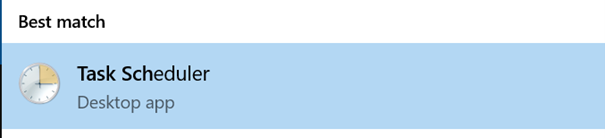

Windows Task Scheduler
================

- [1 Overview](#1-overview)
- [2 Technical details](#2-technical-details)
  - [2.1 Updating R scripts so they can be
    scheduled](#21-updating-r-scripts-so-they-can-be-scheduled)
  - [2.2 Scheduling R scripts to run](#22-scheduling-r-scripts-to-run)
  - [2.3 Keep in mind](#23-keep-in-mind)
  - [2.4 Troubleshooting](#24-troubleshooting)

# 1 Overview

The Windows Task Scheduler, “is a job scheduler in Microsoft Windows
that launches computer programs or scripts at pre-defined times or after
specified time intervals”
[Wikipedia](https://en.wikipedia.org/wiki/Windows_Task_Scheduler). It
typically runs system level things, but you can also schedule your own
tasks, including R scripts.

When you schedule a task, you should try to schedule it on a computer
that is always on, like a server or a desktop, as tasks won’t run if the
computer is off.

# 2 Technical details

## 2.1 Updating R scripts so they can be scheduled

Before scheduling a script to be run, you need to check a couple things:

1.  Make sure all the packages you are using in the script are
    `library()`-ed in the script (just like you need to do with a
    markdown). Also make sure that all of the packages are installed on
    the computer where you are scheduling the script.

2.  Make sure your script runs without errors. Even if the error isn’t
    important to the script (ex: you accidentally reference a dataset
    that doesn’t exist and doesn’t affect the code after it), you need
    to remove it. The scheduler will stop running the R script as soon
    as it encounters an error.

3.  If you specify the task should be run whether or not you’re logged
    on or not (more on that a little later), you need to ensure that
    you’re not using any mapped file paths. Ex, if you have folder
    `\\root\sub-folder` mapped to `B:`, you’d need to reference the full
    path (`\\root\sub-folder\file`) in the script and not `B:\file`.

## 2.2 Scheduling R scripts to run

1.  On the computer you plan to schedule the script, launch the **Task
    Scheduler** application.



2.  In the task scheduler, go to the **Task Scheduler Library**. You
    should see it in the upper left corner.


3.  Then on the right-hand side, select the option to **Create Task**
    from the Actions menu:


4.  In the **General** tab, you’ll need to put in a name and when the
    task should run. More discussion on this in the [Keep in
    mind](#keep-in-mind%20section). Add a description so others know
    what the script does. Note: once you create the task, you can’t
    change the name of the task, though you can update the description.


5.  In the **Triggers** tab, select **New** and then choose when and how
    often the task should run:


6.  Go to the **Actions** tab. This is where you’ll specify the R
    installation and script to run.

<!-- -->

1.  Select **New**.  
2.  In the **Edit Action** tab, the default action should be “Start a
    program”. This is the action you want.  
3.  In the **Program/script** field, fill in the R installation you want
    the Task to run on. Make sure you use the `Rscript.exe` and not
    `R.exe`.  
    \* ex: Program/script: “C:Files-X.X.X.exe” (note, this should be
    wrapped in quotes)  
4.  Add arguments (optional) field is NOT optional here. This is where
    you’ll specify the path to the script you want to schedule. Prefix
    the script with `-e "source('` and include a `')"` at the end. Use a
    full file path here. \* ex:
    `-e "source('\\root\sub-folder\file.R')"` \* note: the path needs to
    be EXACTLY where the script lives. Triple check that you don’t have
    extra spaces, characters, etc. A single extra space will mean the
    script isn’t found and isn’t run.


## 2.3 Keep in mind

1.  When you change your password, you also need to re-save your tasks
    with your new password. Windows uses your authentication to run the
    tasks so it needs an updated password. You should change something
    in the task (ex: change the time from 6:09 to 6:10) so you will be
    prompted to re-enter your password

2.  Should the task run “only when user is logged on” or “whether user
    is logged on or not”?

The task will run most consistently if you run the task “whether user is
logged on or not”. In most cases this should work as long as you’ve
set-up your script to work according to
\#updating-r-scripts-so-they-can-be-scheduled. However, if your script
needs something that you specifically need access to (ex: an Outlook
inbox), you’ll probably need to run the task “only when user is logged
on”.

## 2.4 Troubleshooting

If your task isn’t working, when you try to run it you’ll get a Last Run
Result of “(0x1)”:

When this happens, here are some steps you can take to troubleshoot. 1.
Check that the R code will run on the computer where you’re trying to
schedule the script.  
\* Simply copy all the code from the R script and paste it into a new R
(not RStudio) session.  
\* You can access the R application from Windows Explorer \> Local Disk
(C:): \> Program Files \> R \> R-4.X.X (the most current one) \> bin \>
`R.exe` (not `Rscript.exe`) \* See if the script runs all the way
through or if it errors out. If there is an error, review it, fix it and
then try it again. \* Once the script is running all the way through,
copy the updated version into your saved `.R` file and try triggering
the task again. If the task works, yay! If not, continue on.

2.  Check the task file path

- Once you know that the script runs on the server, you know the issue
  must be somewhere in the task. The issue is likely in the file path in
  the task
- Open the task, go the Actions tab, edit the action and copy the file
  path from the Add Arguments (optional): field into a text editor of
  your choice (I usually do it in an email draft)
- Review the text. The format should be:
  - `e "source('path.R')"`
  - the actual path should:
    - point to the folder using the actual path not letters (ex:
      `\\root\sub-folder` not `B:`)
    - point exactly to the file!!
    - not have extra spaces.
      - NOT OK: `\\ root\sub-folder`
      - OK: `\\root\sub-folder`
    - Make sure the file path has the `.R` or `.Rmd` at the end
- Once you’re sure the path is correct, try running the script again. If
  the task doesn’t work, continue on.

3.  If you’re sure the script works and are sure the task is correct,
    try scheduling a tiny task and running it. Ex: write a script that
    only uses base R to save a string as a data frame.

- Example:

``` r
string <- c("hello", "world")
string_df <- data.frame(string)
write.csv(string_df, “path”)
```

- If it works, then the issue is still with your script. If it doesn’t
  work, there might be a larger permissions issue with task scheduling.
